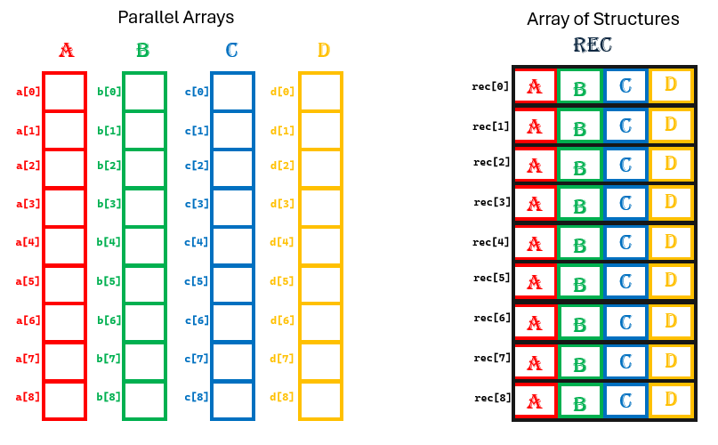

# Workshop #5: Structures


In the process of doing your workshop 5 you are to remove the parallel array logic from workshop 4 and instead process the information in ONE array of Student structure then print a report for the students' marks.


## Learning Outcomes

Upon successful completion of this workshop, you will have demonstrated the abilities to:

- Create a structure in C language 
- Pass structure arrays to functions
- Access structure elements and elements of array structures elements
- Return multiple student information from a function by returning a single structure
- use "const" to pass a read-only array of structures to a function
- use a structure to handle multiple records of an Item.

## Submission Policy


This workshop is divided into two parts, one coding part and one non-coding part.

- The coding part is worth 100% of the mark 
- *reflection*: non-coding part. The reflection doesn't have marks associated with it but can incur a penalty of max 30% of the whole workshop's mark if your professor deems it insufficient (you make your marks from the code, but you can lose some on the reflection).

The submission of the workshop will be under the name `144/w5/p1`

## Due Dates

The Due dates depend on your section. Please choose the "-due" option of the submitter program to see the exact due date of your section:

```bash
~profname.proflastname/submit 1??/wX/pY -due<ENTER>
```
- Replace **??** with your subject code (`00 or 44`)
- Replace **X** with Workshop number: [`1 to 10`]
- Replace **Y** with the part number: [`1 or 2`]

## Late penalties

The workshop is due Three days after the posting. Then 10% penalty for each day being late up to 5 days.

## Citation

Every file that you submit must contain (as a comment) at the top:<br />
**your name**, **your Seneca email**, **Seneca Student ID** and the **date** when you completed the work.

### For work that is done entirely by you (ONLY YOU)

If the file contains only your work or the work provided to you by your professor, add the following message as a comment at the top of the file:

> I have done all the coding by myself and only copied the code that my professor provided to complete my workshops and assignments.

### For work that is done partially by you.

If the file contains work that is not yours (you found it online or somebody provided it to you), **write exactly which part of the assignment is given to you as help, who gave it to you, or which source you received it from.**  By doing this you will only lose the mark for the parts you got help for, and the person helping you will be clear of any wrongdoing.

> - Add the citation to the file in which you have the borrowed code
> - In the 'reflect.txt` submission of part 2 (DIY), add exactly what is added to which file and from where (or whom).

> :warning: Workshops with no Citation will receive a mark of zero

> :warning: This [Submission Policy](#submission-policy) only applies to the workshops. All other assessments in this subject have their own submission policies.

### If you have helped someone with your code

If you have helped someone with your code. Let them know of these regulations and in your 'reflect.txt' of part 2 (DIY), write exactly which part of your code was copied and who was the recipient of this code.<br />By doing this, you will be clear of any wrongdoing if the recipient of the code does not honour these regulations.


## Compiling and Testing Your Program

All your code should be compiled using this command on `matrix`:

```bash
gcc -Wall -o ws file1.c file2.c ... <ENTER>
```

- `-Wall`: the compiler will report all warnings
- `-o ws`: the compiled application will be named `ws`

Check the output, and closely compare it with the expected output. Make sure the match exactly since with submitting your work, only perfect outputs can pass the submission program.


## Student Record
To start workshop 5 create a structure for a student. Doing so, instead of using many arrays to hold many records of students you will be holding one array of student records.



Create the `Student` structure in 'report.h' file with the following member variables:
```c
float mark;  // to hold the mark of the student
int stNo; // to hold the student number
char name[31]; // to hold the student name up to 30 characters in a Cstring
```

> Having the structure definition in the header file, identifies it to any file including that header file:
 

## Modules

### `utils module`
All the data entry for the number should be fool-proof in this workshop.

Add the following functions to the `utils` module by adding the function implementations to the `C` file and the prototype to the `header` file.

#### int getInt( void);
`getInt` gets an integer from the console and returns it to the caller program.

This function should receive an integer from the keyboard. If the user does not enter a proper integer function, the function should display the following error message
```c
"Bad integer, try again\n> "
```
and ask for the integer again. The function will not allow the user to leave the integer entry unless only an integer is entered following `<ENTER>` key.

After the function ends, the keyboard buffer must be empty. 

#### float getFlt(void);
`getFlt` works exactly like getInt, except that it receives a proper floating point number from the console.

The error message for this function should be:
```c
"Bad real number, try again\n> "
```
#### `void getLine(char cstr[])`

`getLine` receives a C-string from the console up to the newline character. 

After the function ends, the keyboard buffer must be empty. 


### `report module`
You are to implement four functions in a file called 'report.c' and add their prototypes to a header file 'report.h'.

#### `struct Student getStudent(void);`

`getStudent` receives the (foolproof) student information from the console as follows:
> Use the functions in the `utils function`

```text
Name
> John Doe<ENTER>
Student Number
> 123123<ENTER>
Mark
> 66.6<ENTER>
----------------------
```

Assuming that the `John Doe<ENTER>`, `123123<ENTER>` and `66.6<ENTER>` entries are entered by the user.

The following is the same data entry example, demonstrating the user's entry mistakes:

```text
Name
> John Doe<ENTER>
Student Number
> one two three<ENTER>
Bad integer, try again
> 123 and 123<ENTER>
Bad integer, try again
> 123123<space><ENTER>
Bad integer, try again
> 123123<ENTER>
Mark
> 66.6 is the mark<ENTER>
Bad real number, try again
> mark is 66.6<ENTER>
Bad real number, try again
> 66.6      <ENTER>
Bad real number, try again
> 66.6<ENTER>
----------------------
```

#### void printStudent(struct Student S);
`printStudent` prints a student in the following format:

```text
John Doe                      | 123123         |  66.0
```
- name: 30 spaces, left justified
- `|` and a `<space>`
- student number: 15 spaces left justified
- `|`
- mark: 6 spaces with one digit after the decimal point right justified

#### `void printReport(const struct Student S[], int num);`

`printReport` lists the students' information and the average mark of the class at the end as follows.

```text
Name                           student number   mark
------------------------------+----------------+------
Jimbo Jones                   | 123123         |  55.5
Nelson Muntz                  | 234234         |  33.3
Bart Simpson                  | 456456         |  88.8
------------------------------+----------------+------
                                       Average:   59.2
```

> see the [correct_output.txt](lab/correct_output.txt) for the format of the printout

#### `void readStudentInfo(struct Student S[], int num);`

`readStudentInfo` reads the information for `num` students into `S`, which is an array of `Student`s structure as follows:


1. prints this prompt:
  `Enter ?? student records:\n`, where `??` is replaced the the value of the `num` argument
2. for `num` times (value of the `num` argument) it will prompt:
   `Enter Student Information # ??:\n`, where `??` is replaced with the row number of the entry.
    And then reads the student information using the `getStudent()` function and places it in the corresponding element of the structure array `S`.


## Main tester program:
[main.c](lab/main.c)

## Sample output

[correct_output.txt](lab/correct_output.txt)

## Submission Process:


### Reflection
First, explain what a C-string is, and then explain what is the difference between a C-string and a character array in C language.

Then Study your final solutions for each deliverable of the workshop, reread the related parts of the course notes, and make sure that you have understood the concepts covered by this workshop.  **This should take no less than 30 minutes of your time and the result is suggested to be at least 150 words in length.**

Create a file named `reflect.txt` that contains your detailed description of the topics that you have learned in completing this workshop and mention any issues that caused you difficulty.

### Data Entry

```text
Jimbo Jones
123123
55.5
Nelson Muntz
234234
33.3
Bart Simpson
abc
123abc
123 <space>
456456
abc
88.8abc
88.8 <space>
88.8
```

### Files to Submit
```text
utils.c
utils.h
report.c
report.h
main.c
reflect.txt
```


### Submission 

Upload the files listed above to your `matrix` account (use git or SFTP). Compile and run your code using the `gcc` compiler as shown in [Compiling and Testing Your Program](#compiling-and-testing-your-program) and make sure that everything works properly.

Then, run the following command from your matrix account

```bash
~fardad.soleimanloo/submit 144/w5/p1  <ENTER>
```

and follow the instructions.

> **Important:** Please note that a successful submission does not guarantee full credit for this workshop. If the professor is not satisfied with your implementation, your professor may ask you to resubmit. Re-submissions will attract a penalty.

