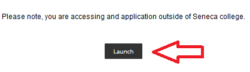
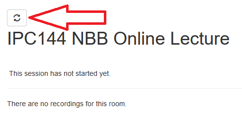
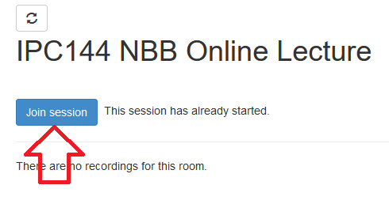
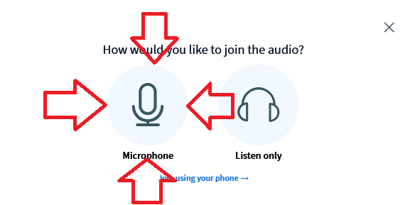
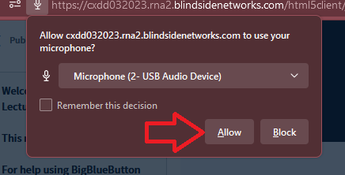
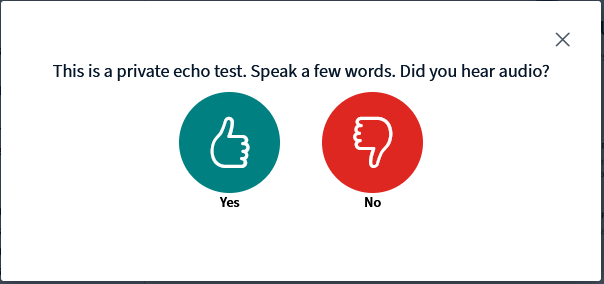
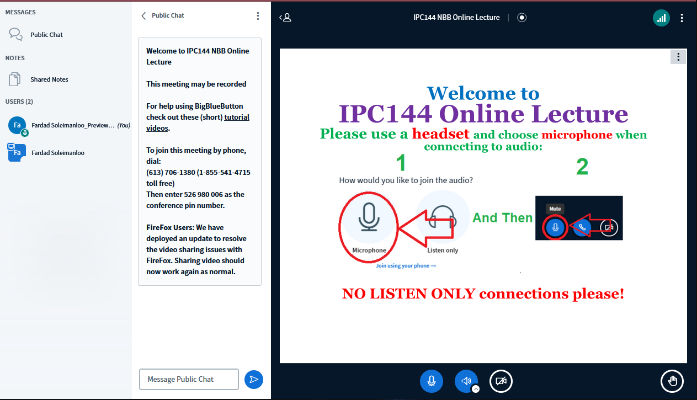

# How to join online classes
([Watch instructions on youtube](https://youtu.be/sB-kckexf3U))
1. Login to MySeneca and Open the IPC144 Subject
2. On left menu click on **Emergency Online Session**

3. Then click on **Lunch** on the next page

4. If the session has not started yet, keep refreshing the page using the refresh button every few seconds.

5. When available click on **Join Session**

6. When connected choose **USE MICROPHONE** and DO NOT join at **LISTEN ONLY"!, unless you have no other choice. If you have to join as Listen only then make sure you are quick to response in the text chat.

7. Allow the browser you access your microphone and sound system.

8. Speak few word in echo test and make sure you hear your own voice, if not click on NO to change your microphone device

9. After connection immediately mute yourself and un-mute only if you need to talk.

10. Wait for the session to begin

11. I will begin the session around 20 minutes early to make sure you can trouble shoot before we begin.

See you inclass :blush: